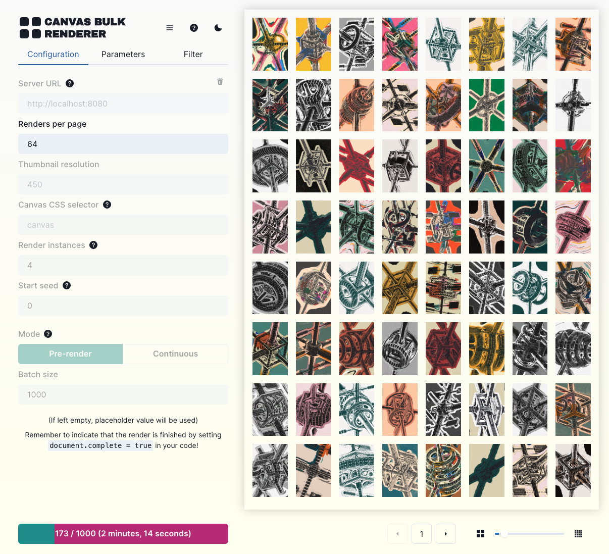

# Canvas Bulk Renderer

Canvas Bulk Renderer is a browser-based tool for bulk rendering images from HTML canvas-based projects and displaying them in a grid.
It does so by running the project in multiple headless browser instances and fetching the image data once finished. 

It has two modes: Pre-render, which renders a specified number of images, and continuous, which renders images page-per-page.

## Use
Run the following commands to get the tool up and running:
```shell
git clone https://github.com/mathiasisaksen/canvas-bulk-renderer
cd canvas-bulk-renderer
npm i
npm run build
npm run start
```

Note: the backend does not work properly in dev mode.

<p align="center">
</img>
</p>